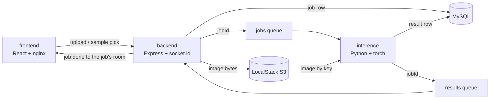

# Pet Expressions

[](https://github.com/OzDomer/jb-45800-5-project-4/actions/workflows/tests.yml)

A browser app that reads a pet's facial expression from a photo. Upload a
picture of a cat or a dog (or click one of the built-in samples) and a
fine-tuned ResNet-18 answers with **Angry / Sad / happy / Other**, along
with the full probability breakdown — delivered live over a socket the
moment inference finishes.

The model is the classifier trained in
[jb-45800-5-mission-4](https://github.com/OzDomer/jb-45800-5-mission-4)
(ResNet-18, ImageNet backbone fine-tuned on a pet facial-expression
dataset, **94.37% validation accuracy**). The trained `model.pt` is
committed in this repository — inference depends on it, the training data
does not ship here.

## Running

```bash
docker compose up --build
```

That is the whole procedure. When the five containers are up:

| URL | What |
|---|---|
| http://localhost:5173 | The app |
| http://localhost:3000/api/health | Backend health check |
| http://localhost:4566 | LocalStack (S3 + SQS) |

## Architecture

Five containers, queue-based communication between the web side and the
inference side:



**Job lifecycle:** the backend stores the image in S3, inserts a `pending`
row in MySQL, sends `{jobId}` to the jobs queue and answers `202`. The
Python worker — a long-running SQS consumer that loads the model **once**
at startup — downloads the image by its S3 key, predicts, updates the row,
and sends `{jobId}` to the results queue. The backend reads the row and
emits `job:done` into the job's socket.io room. The browser, which joined
that room right after the `202`, renders the result.

## Design decisions

- **Queue messages are pointers.** Both queues carry only `{jobId}`; the
  result itself lives in one place — the MySQL row. The worker always
  updates the row *before* sending the pointer, so the backend can never
  read a non-terminal row for a finished job.
- **Socket.io rooms, not broadcast.** The client emits `job:watch` after
  the `202` and results are emitted with `io.to(jobId)` — one browser's
  prediction never reaches another browser. The join race (inference
  finishing before the join lands) is closed by a single
  `GET /api/predictions/:jobId` right after joining — the same code path
  that recovers state after a page refresh. Broadcast-to-everyone was the
  simpler baseline we deliberately outgrew.
- **The database stores the S3 *key*, never a URL.** Browser-facing URLs
  are derived at response time from the `aws.publicUrl` config. Inside
  compose, the SDK's upload response points at `http://localstack:4566/...`
  — a hostname that exists only on the docker network, which is exactly
  why it is never persisted.
- **Failure handling is split by retryability.** Deterministic failures
  (undecodable image, unknown job, missing S3 key) mark the job `failed`
  and delete the message — retrying can never fix them. Transient failures
  (MySQL/S3 unreachable) leave the message alone: SQS redelivers after a
  60-second visibility timeout, and a redrive policy dead-letters anything
  received more than 5 times, so a poison message cannot cycle forever.
- **At-least-once delivery is handled.** A redelivered message for an
  already-finished job is skipped (no second inference) and its pointer is
  re-sent, so a lost notification always heals.
- **Sample images are seeded server-side.** The backend bundles four demo
  images and seeds them into S3 under a `samples/` prefix on startup
  (HeadObject-then-upload, so restarts are idempotent). A sample
  prediction is a JSON request that points a new job at the existing key —
  no bytes make a round trip through the browser, and ten clicks on the
  same sample still mean one S3 object.

## API

| Method | Path | Purpose |
|---|---|---|
| `POST` | `/api/predictions` | Multipart upload (`image` field) → `202 {jobId, ...}` |
| `POST` | `/api/predictions/sample` | `{"name": "..."}` → `202`, job on a seeded image |
| `GET` | `/api/predictions/:jobId` | Current job state (polling fallback / refresh recovery) |
| `GET` | `/api/samples` | The seeded demo images (`[{name, imageUrl}]`) |
| `GET` | `/api/health` | Liveness |

Socket.io: emit `job:watch` with a jobId to join its room; receive
`job:done` with the full job payload when inference finishes.

Uploads are capped at 10MB (`upload.maxFileSizeMb` in the backend config)
and must actually be images — the backend sniffs the magic bytes
(jpeg/png/gif/webp/bmp); violations get friendly `400`/`413` answers.

## Tests

The two spots where logic (rather than plumbing) lives are unit-tested:

```bash
# magic-byte detection: five real format headers + seven forgeries
cd backend && npm test

# the worker's failure contract: deterministic failures are recorded and
# deleted, transient ones survive for redelivery, poison messages are
# dropped -- runs inside the already-built image, no extra dependencies
docker compose run --rm inference python -m unittest discover -s src/tests -t . -v
```

## Notes

- The model is imperfect and the built-in samples do not hide it: the
  shark comes back **Other** (correct — it was trained on cats and dogs),
  and some of the original dataset's harder samples are genuinely
  misclassified, consistent with the mission-4 evaluation.
- LocalStack community serves S3 objects to unauthenticated GETs, which is
  what lets the browser load images straight from
  `http://localhost:4566/...`. Real AWS S3 would 403 — production would
  need a bucket policy or presigned URLs.
- Upload validation is layered: the backend checks the declared mimetype
  (courtesy 400), then **enforces the content** by sniffing magic bytes —
  a client lying about the type (`curl -F "image=@evil.bin;type=image/png"`)
  is rejected on the bytes, and the stored key/ContentType come from the
  sniffed format, never the client's claim. A file that fakes a valid
  header but is not decodable still gets caught by the final gate: the
  worker's decode marks the job `failed`.
- Room isolation is "a UUIDv4 is unguessable", not authentication —
  `job:watch` joins any room a client names. Guessing a foreign job id is
  the attack, and 122 random bits is the defense. Enough here; real auth
  would gate the join.
- The results consumer lives inside the backend process. With multiple
  backend replicas, each socket client is connected to one replica while
  any replica may consume the result — rooms would need a socket.io
  adapter (e.g. Redis) to span replicas. One replica, as composed here,
  needs none of that.
